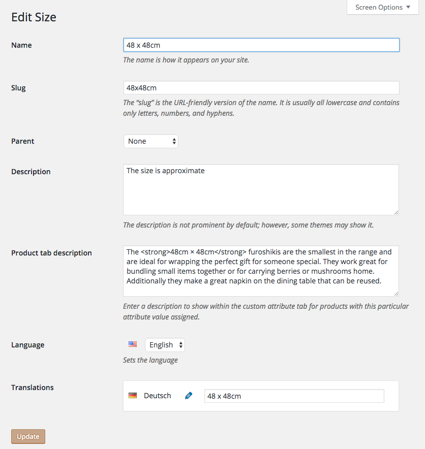
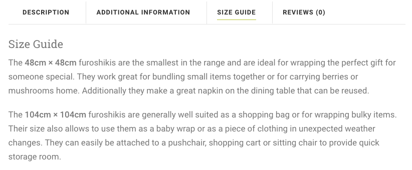

# Product Attribute Tab for WooCommerce #
**Contributors:** mjke87  
**Donate link:** http://livegreen.ch/en/donate  
**Tags:** woocommerce, product, attribute, product attribute, product tab, product attribute tab  
**Requires at least:** 4.4.0  
**Tested up to:** 4.5.2  
**Stable tag:** 0.0.1  
**License:** GPLv2 or later  
**License URI:** http://www.gnu.org/licenses/gpl-2.0.html  

Adds the possibility to show an extra tab on the product page for configured product attributes.

## Description ##

This plugin allows you to display WooCommerce product attribute information in a separate tab on the product detail page. This allows you to reuse any descriptions that are specific to certain attributes without rewriting all information for every applicable product again and again. 

The plugin creates a new field for every product attribute taxonomy that can be used to display additional information related to a specific attribute. The extra information will be displayed in a separate tab with the product attribute taxonomy name as the tab title. The content of the tab will show all applicable attribute tab descriptions. The extra field lets you also use HTML and even shortcodes.

### Example ###
Let's say we have a product attribute taxonomy named *Size*. For all products that are using this attribute type we wish to display a size guide on the product page, which helps the customer to find the right size. We use the plugin to specify a tab description for every size that we configured (e.g. XS, S, M, L, XL). The tab description for a size attribute could for example explain the recommended body measurements that fit this size. Finally we create a product where we assign the size attribute and select the attribute values S, M and L. On the product page of this product we will now see a new tab named *Size* that shows the tab descriptions of the size attributes S, M and L.

## Installation ##

1. Upload the plugin files to the `/wp-content/plugins/plugin-name` directory, or install the plugin through the WordPress plugins screen directly.
1. Activate the plugin through the 'Plugins' screen in WordPress
1. Make sure that WooCommerce is installed and activated, otherwise the plugin won't work
1. Go to Products -> Attributes -> Select a attribute taxonomy -> Use the *Product Tab Description* field to make use of the plugin
1. Add to attributes with descriptions to products to display the new tab on the product page
1. Use the plugin filter and action hooks to configure the plugin as needed

## Frequently Asked Questions ##

### Why does the product tab description not show up on the product page? ###

The description will only be visible if the product is associated with that specific attribute where you added you description. Every available attribute description will be wrapped in a separate paragraph.

### Why does the plugin not use the default description field? ###

The plugin creates a new meta field to avoid conflicts with the existing attribute descriptions, as they might already be used for other purposes.

### How can I still use the default attribute description instead? ###

This can be done with two simple steps and simple code snippets in your theme, e.g. `functions.php`.

Firstly, you'll have to remove the hook that registers the new product tab description field; add the following code to do so:

    // Remove the hook that registers the new product tab description field
    remove_action('init', array(MJJ\WooProductAttributeTab\Meta::instance(), 'init'));

Secondly you'll have to tell the plugin to use the default description meta field instead; add the following code to do so:

    // Use default description meta field for product attribute tab
    add_filter('woocommerce_product_attribute_meta_key', function($key) {
        return '';
    });

### How can I change the tab title? ###
The default name of the product tab is the name of the product attribute taxonomy, hence you can change the attribute taxonomy title to change the tab title. If you wish to rename the tab title independently of the attribute taxonomy title, you can use the following code snippet example in your theme, e.g. `functions.php`:

    // Rename product attribute tab titles
    add_filter('woocommerce_product_attribute_tab_title', function($title, $product, $attribute) {
        if ($attribute['name'] == 'pa_size') {
            return __('Size Guide', 'text-domain');
        }
        return $title;
    });

The above example would rename the product attribute tab title for the product attribute taxonomy *size* to *Size Guide*.

## Screenshots ##

1. The extra product tab description field in the product attribute edit screen.
 
1. Two product attribute descriptions displayed at once on the product detail page.
 

## Changelog ##

### 0.0.1 ###

* First stable release.

## Upgrade Notice ##

* None yet.
